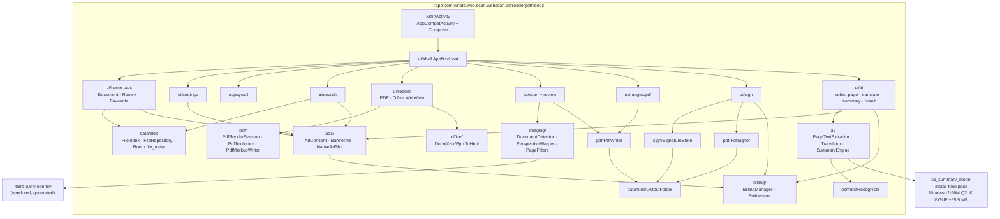
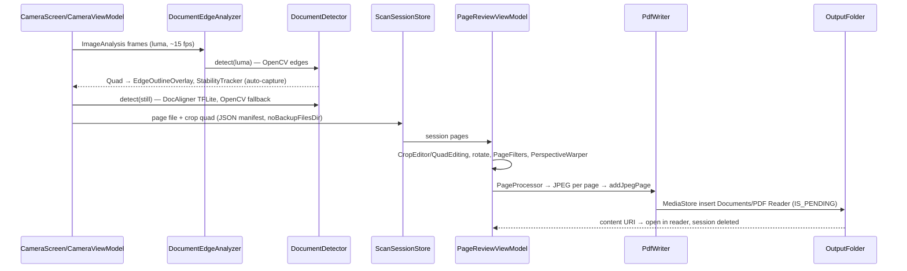
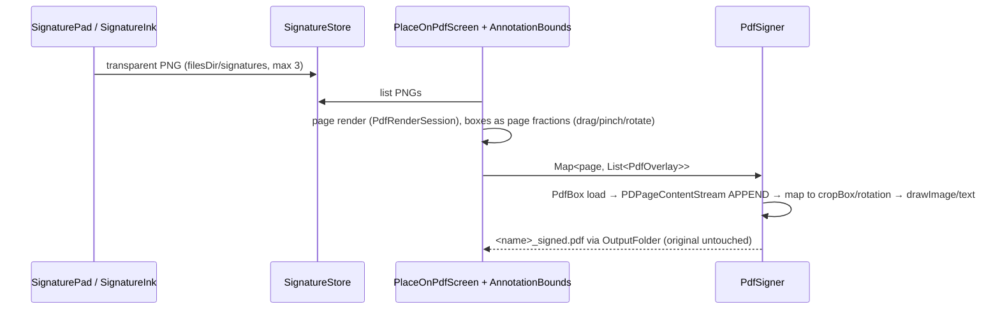
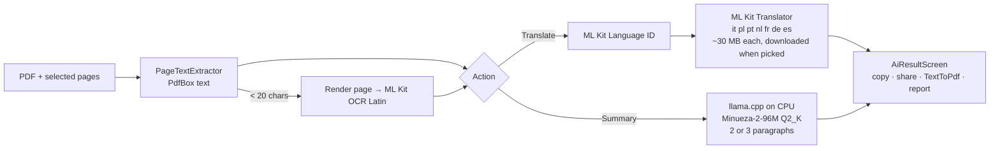

# Architecture

Structure only. Requirements = `BRD.md`, how-to = `TECH_SPEC.md`, status = `workdone.md`.

## Current (2026-09-29)

Android Studio "No Activity" template. Verified by reading the files and by the code graph (`graphify-out/`).

```
PDFreaderPDFFileedit/                rootProject.name "PDF reader & PDF File edit"
├─ settings.gradle.kts               include(":app"); foojay toolchain resolver
├─ build.gradle.kts                  android.application plugin (apply false)
├─ gradle/libs.versions.toml         agp 9.3.3, core-ktx 1.19.1, appcompat 1.8.0, material 1.14.0, junit, espresso
├─ gradle/wrapper                    Gradle 9.5.0
└─ app/
   ├─ build.gradle.kts               namespace/applicationId com.whats.web.scan.webscan.pdfreaderpdffileedit
   │                                 compileSdk 37, targetSdk 37, minSdk 24, Java 11, R8 disabled
   │                                 deps: appcompat, core-ktx, material
   ├─ src/main/AndroidManifest.xml   <application> only — no Activity, no permissions
   ├─ src/main/res                   template theme (purple MaterialComponents), launcher icons, strings (app_name)
   ├─ src/main/keepRules/rules.keep  empty R8 rules
   ├─ src/test/.../ExampleUnitTest.kt
   └─ src/androidTest/.../ExampleInstrumentedTest.kt
```

No Kotlin source in `src/main`. No Compose, no DI, no persistence, no networking.

## Target

Single `:app` module, packages per feature (full list in TECH_SPEC §2). Two tooling-forced modules.



### External libraries and what touches them

| Library | Used by |
|---|---|
| PdfRenderer (platform) | `pdf/PdfRenderSession` — page bitmaps, thumbnails |
| PdfBox-Android | `pdf/` text index, highlight annotations, `PdfWriter`, `PdfSigner`, decrypt |
| `android.graphics.pdf.PdfDocument` | `pdf/TextToPdf` — AI output with any script |
| CameraX, LiteRT (DocAligner), OpenCV | `ui/scan`, `imaging/` |
| ML Kit text-recognition (Latin, bundled) | `ocr/` |
| ML Kit translate + language-id | `ai/Translator` |
| llama.cpp via JNI (Minueza-2-96M Q2_K GGUF) | `ai/SummaryEngine` |
| Play Asset Delivery (install-time pack) | `ai/SummaryModelDelivery` |
| Play Billing, AdMob, UMP, In-App Review | `billing/`, `ads/`, `ui/settings` |
| Room, DataStore | `data/files`, `data/prefs` |

## Data flows

### Scan → PDF



### Signature → signed PDF



### On-device AI



No network call carries document text. Network is used for ads, billing, and the one-time translation-model download. The summary model is already on the device after install.

## Rules for implementers

- Screens own UI state in a ViewModel; anything that touches files, PDFs or models lives in `data/`, `pdf/`, `office/`, `imaging/`,
  `sign/`, `ai/` — never in composables.
- All IO/CPU work on `Dispatchers.IO`/`Default`; PdfRenderer access serialised per document (`PdfRenderSession` mutex).
- Colours, type and shapes only from `ui/theme`.
- Ad and Pro checks go through `billing/Entitlement` and `ads/` only.
- `:third-party:opencv` is generated — do not edit (rebuild per ps:`third-party/opencv/README.md`).
